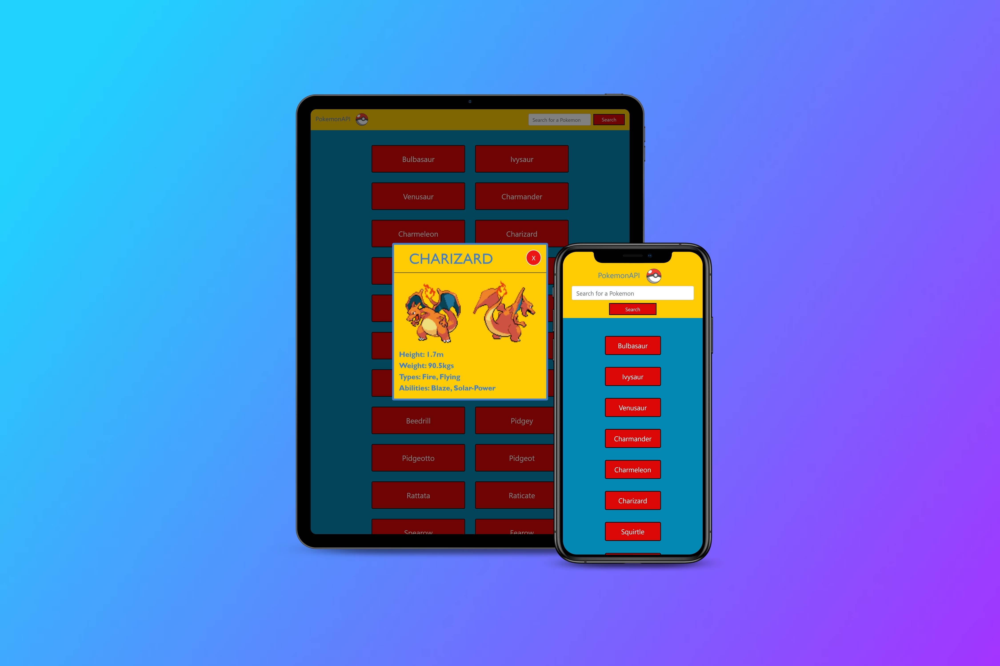

# __PokemonAPI__

A Pokemon themed API app that contains a list of pokemons that were fetched from a database site.  It also includes polyfills.
Simply click on the Pokemon name to view a modal containing a picture and brief description of each Pokemon.  There is also a search bar to narrow down names.  

__link to API__ https://pokeapi.co/api/v2/pokemon/?limit=150

## __Features__
 * A Nav/Search bar that narrows down searches. 
 * A Modal appears whe the Pokemon name is clicked on.  This modal displays the Pokemon's name, images, and some stats.
 * Pokemon stats include:
    * It's weight and height in metric units (I divided the values by 10)
    * 2 Imgs of Pokemon, 1 front and one back
    * Abilities seperated by a comma
    * Types, also seperated buy commas
  * Top of page button for easier navigation

## __Design__
  * I chose to make this app appear someonewhat "animated" as this is the nature of the TV show.  I stuck with solid color(Pokemon-themed obviously) and didn't want to implement any realistic images or detailing.  
  * The close buttons are round to represent the Pokemon balls seen in the show.  
  * Pokemon ball favicon

### __Dependencies__
* HTML
* CSS
* Javascript
* jQuery
* .fetch
